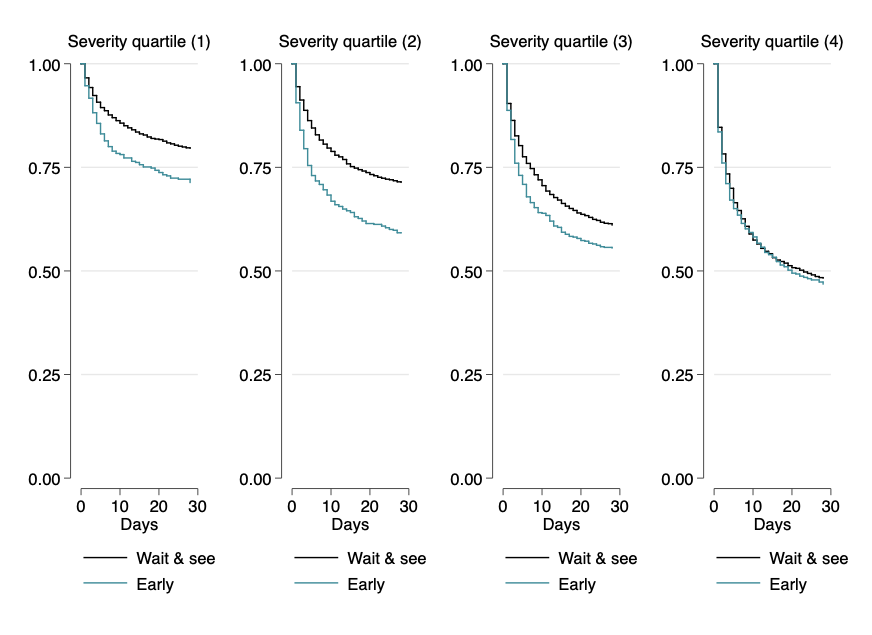

Deteriorating ward patients and timing of admission to critical care - individual patient data from NHS hospitals.

These data are from a study of deteriorating patients in NHS hospitals that examined delay to admission to critical care timed from the bedside assessment by the critical care outreach team. The primary endpoint was 90-day mortality. This was a prospective cohort study of consecutive patients in 49 NHS hospitals (1 November 2010 — 31 December 2011). More detail can be found in the published reports.[^1]

| {: width="600" } |
| :-- |
|_Figure 1: Complete patient follow-up_|

Uniquely, the study followed all patients regardless of the decision to admit thereby allowing an estimate of outcome without treatment selection bias.

| {: width="600" } |
| :-- |
|_Figure 2: Patient mortality by severity of illness quartiles_|

<iframe src="https://widgets.figshare.com/articles/25142777/embed?show_title=1" width="568" height="351" allowfullscreen frameborder="0"></iframe>

The data were collected as part of a PhD project funded by the Wellcome Trust.

[^1]: Harris S, Singer M, Sanderson C, Grieve R, Harrison D, Rowan K. [Impact on mortality of prompt admission to critical care for deteriorating ward patients: an instrumental variable analysis using critical care bed strain](https://doi.org/10.1007/s00134-018-5148-2). Intensive Care Med. 5/2018;44: 606–615.
