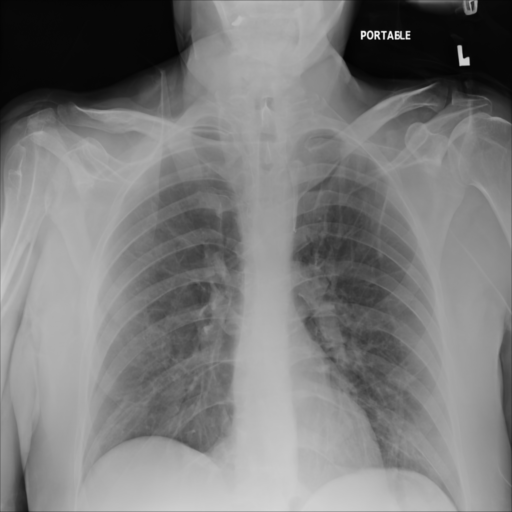

# Example (synthetic) images

## Model

A Hugging Face Unconditional image generation Diffusion Model was used for training. [1] Unconditional image generation models are not conditioned on text or images during training. They only generate images that resemble the training data distribution. The model usually starts with a seed that generates a random noise vector. The model will then use this vector to create an output image similar to the images used to train the model.
The training script initializes a UNet2DModel and uses it to train the model. [2] The training loop adds noise to the images, predicts the noise residual, calculates the loss, saves checkpoints at specified steps, and saves the generated models.

## Training Dataset

The RANZCR CLiP dataset was used to train the model. [3] This dataset has been created by The Royal Australian and New Zealand College of Radiologists (RANZCR) which is a not-for-profit professional organisation for clinical radiologists and radiation oncologists. The dataset has been labelled with a set of definitions to ensure consistency with labelling. The normal category includes lines that were appropriately positioned and did not require repositioning. The borderline category includes lines that would ideally require some repositioning but would in most cases still function adequately in their current position. The abnormal category included lines that required immediate repositioning. 30000 images were used during training. All training images were 512x512 in size.
Computational Information
Training has been conducted using RTX 6000 cards with 24GB of graphics memory. A checkpoint was created after each epoch was saved with 220 checkpoints being generated so far. Each checkpoint takes up 1GB space in memory. Generating each epoch takes around 6 hours. Machine learning libraries such as TensorFlow, PyTorch, or scikit-learn are used to run the training, along with additional libraries for data preprocessing, visualization, or deployment.

## References

1. https://huggingface.co/docs/diffusers/en/training/unconditional_training#unconditional-image-generation
2. https://github.com/huggingface/diffusers/blob/096f84b05f9514fae9f185cbec0a4d38fbad9919/examples/unconditional_image_generation/train_unconditional.py#L356
3. https://www.kaggle.com/competitions/ranzcr-clip-catheter-line-classification/data
